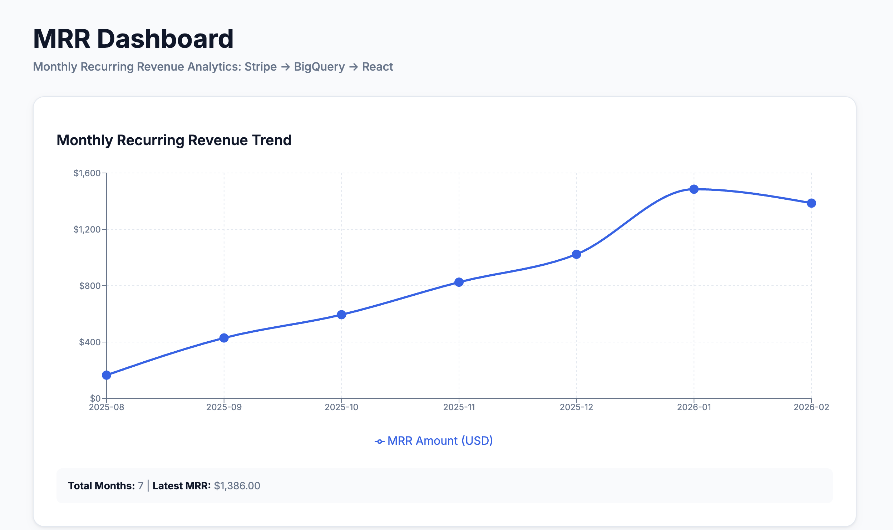

# static-rabbit-74213

AI-Native MRR Dashboard: Stripe → BigQuery → React

**[🔗 Live Demo](https://javvad.dev/stripe_mmr)**

## Overview

This project demonstrates a complete data pipeline for calculating and visualizing Monthly Recurring Revenue (MRR) from Stripe subscription data.

**Tech Stack:**
- **Source:** Stripe API (Python)
- **Warehouse:** Google BigQuery (SQL)
- **Frontend:** React + Vite + Recharts

## Project Structure

```
├── scripts/
│   ├── generate_stripe_test_data.py  # Creates 50-100 test customers with 6-month history
│   ├── load_to_bq.py                 # ETL pipeline: Stripe → BigQuery
│   ├── query_mrr.py                  # Executes MRR SQL and exports to frontend
│   └── requirements.txt              # Python dependencies
├── sql/
│   └── mrr_by_month.sql              # MRR calculation query
├── frontend/
│   └── src/
│       ├── App.jsx                   # Main React component
│       ├── components/MrrChart.jsx   # Line chart visualization
│       └── data/mockMrr.json         # MRR data from BigQuery
└── .env                               # Environment variables (not committed)
```

## Prerequisites

1. **Stripe Account** (Test Mode)
   - Sign up at https://stripe.com
   - Get your test secret key (starts with `sk_test_`)

2. **Google Cloud Platform**
   - Create a project at https://console.cloud.google.com
   - Enable BigQuery API
   - Create a service account and download JSON credentials

3. **Local Environment**
   - Python 3.10+
   - Node.js 18+

## Setup Instructions

### 1. Environment Configuration

Create a `.env` file in the project root:

```bash
# Stripe
STRIPE_SECRET_KEY=sk_test_...

# BigQuery
GOOGLE_APPLICATION_CREDENTIALS="keys/your-service-account.json"
BQ_DATASET="stripe_mrr"
BQ_PROJECT_ID="your-gcp-project-id"

# Generator options
NUM_CUSTOMERS=75
MAX_DAYS_BACK=180
STEP_DAYS=31
OVERDUE_PROB=0.10
CANCEL_PROB=0.20
SEED=43
```

### 2. Install Python Dependencies

```bash
python3 -m venv .venv
source .venv/bin/activate  # On Windows: .venv\Scripts\activate
pip install -r scripts/requirements.txt
```

### 3. Generate Stripe Test Data

This creates ~75 customers with 6 months of billing history using Stripe Test Clocks:

```bash
python3 scripts/generate_stripe_test_data.py
```

**What it does:**
- Creates test customers with varying subscription statuses (Active, Canceled, Past Due)
- Uses Stripe Test Clocks to simulate 6 months of invoice history
- Generates realistic SaaS subscription data ($19-$49/month tiers)

### 4. Load Data to BigQuery

Extract data from Stripe and load into BigQuery:

```bash
python3 scripts/load_to_bq.py
```

**What it loads:**
- `invoices` table: Payment history with amounts and billing periods
- `subscription_items` table: Subscription pricing and status details

### 5. Calculate MRR

Run the SQL query and export results to the frontend:

```bash
python3 scripts/query_mrr.py
```

This executes [sql/mrr_by_month.sql](sql/mrr_by_month.sql) and saves results to `frontend/src/data/mockMrr.json`.

### 6. Run the Frontend

```bash
cd frontend
npm install
npm run dev
```

Open http://localhost:5173 to view the MRR dashboard.

## Screenshot



---

**Built with AI assistance using Github Copilot**